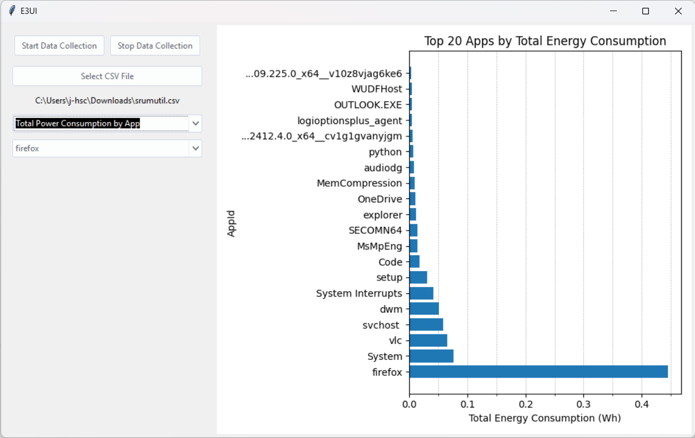
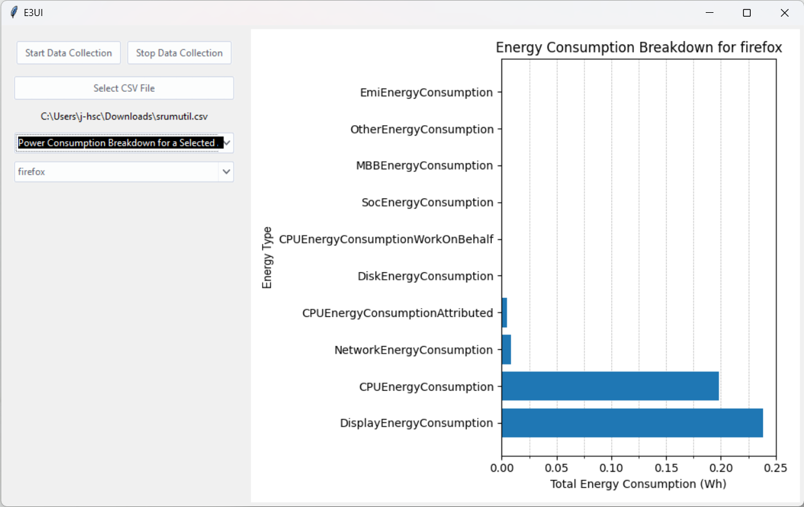
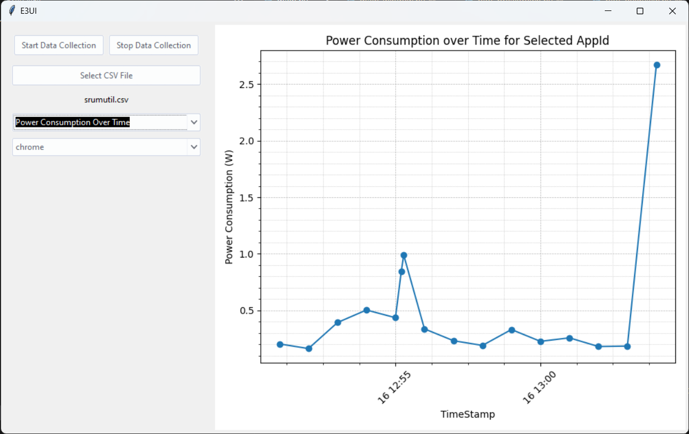
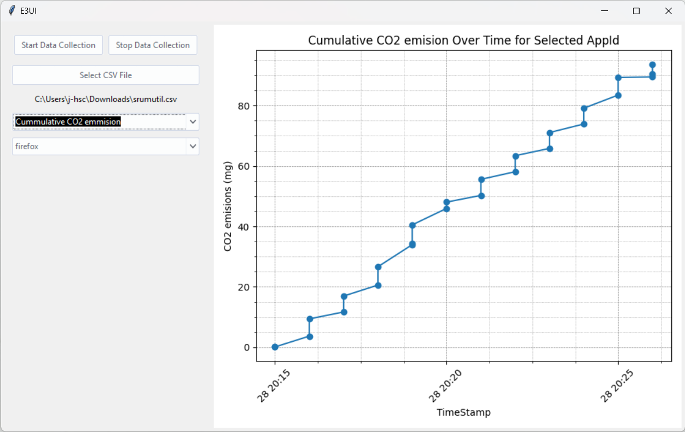

# E3UI

E3UI is a tool designed for monitoring and analyzing energy consumption of applications on Windows devices equipped with batteries. Using the Microsoft Energy Estimation Engine (E3), E3UI provides insights into the power usage of individual applications, setting it apart from other profilers.

<p float="left">
  
   
</p>
<p float="left">
  
  
</p>

## Features

- **Start and Stop Monitoring**: Easily initiate and halt energy usage monitoring with simple commands.
- **Independent Application Analysis**: Unlike many profilers, E3UI can measure the energy impact of applications independently.
- **Insightful Data Analysis**: Dive into the generated data to understand and optimize the energy consumption of your applications.

## Requirements

- **Operating System**: Windows (E3UI is specifically designed for Windows due to its reliance on Microsoft's Energy Estimation Engine system calls).
- **Hardware**: Device with a battery (e.g., laptops). Desktop computers without a battery are not supported due to the nature of the energy estimation.

## Installation

To set up E3UI on your system, follow these steps:

1. Clone the repository to your local machine:
   ```
   git clone git@github.com:daniel-chou-rainho/e3ui.git
   ```
2. Ensure you have Python installed. E3UI is developed and tested with Python 3.8+. You can download Python from [here](https://www.python.org/downloads/).

3. Install the necessary Python packages:
   ```
   pip install -r requirements.txt
   ```

## Usage

To start the application, simply run the following command in your terminal with administrative privileges:

```python
python main.py
```

Use the graphical interface to start and stop the monitoring process as needed. The application will automatically handle the data collection and analysis, presenting the results in an easy-to-understand format.

## License

[MIT License](LICENSE)
